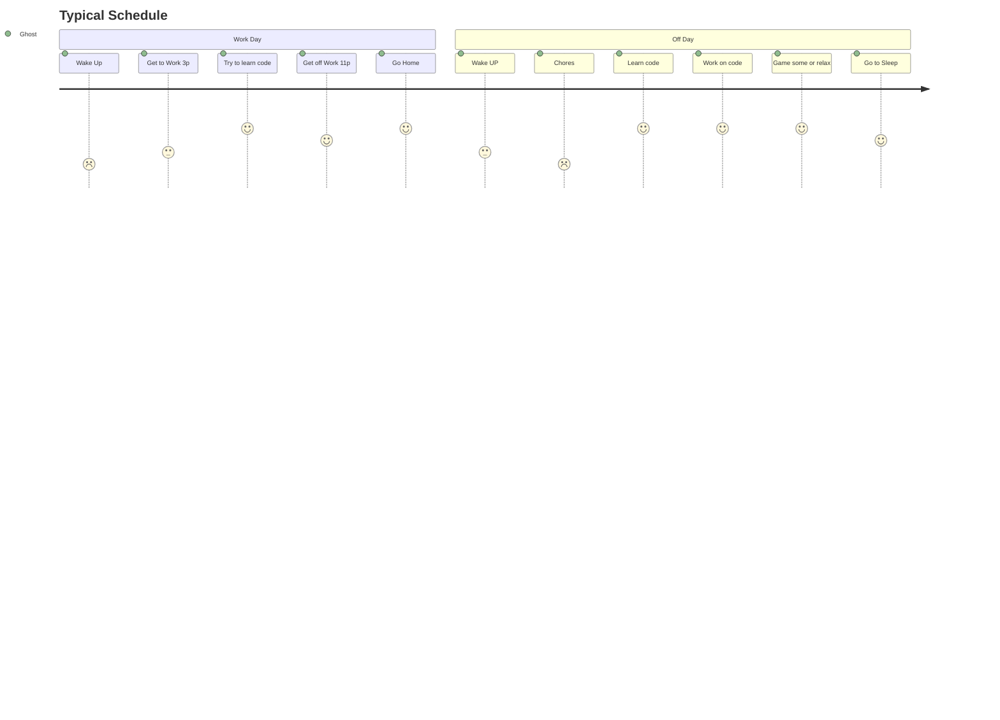

<picture>
  
</picture>

  

I am ambitious and hardworking. Once I've set my mind on something then I work to achieve that goal. I can be a perfectionist and will sometimes spend extra time on somethings than I probably should, but planning ahead and preparing for it is never a bad thing (I don't think). I do tend to hyper-focus alot once I'm started on a series of tasks.

### 
(☞ﾟヮﾟ)☞ Current Goals ☜(ﾟヮﾟ☜)

- 👀 I’m interested in learning more about coding and making programs.
- 🌱 I’m currently learning to write code.
- 💞️ One day I'd like to collaborate on future projects.

### 
GitHub Metrics

 

---

# 
My Projects

- [x] `Archived` [SynXis PM Autoloader](https://github.com/Ghostridr/SynXis) 

- [ ] `Current` [Ground Zero](https://github.com/Ghostridr/Ground-Zero)     

# 
Typical Schedule

Journey Chart

  

  

## 
Contact Info

📫 How to Reach Me

Platform|Tag
:---:|:---:
[Discord](https://support.discord.com/hc/en-us/articles/218344397-How-do-I-add-my-friend-to-my-friends-list-) | [ ]#0001
[Telegram](https://t.me/Ghostridr01) | Ghostridr01

---
> If we pull together and commit ourselves, then we can push through anything.

— Unknown

<!---
Ghostridr/Ghostridr is a ✨ special ✨ repository because its `README.md` (this file) appears on your GitHub profile.
You can click the Preview link to take a look at your changes.
--->

