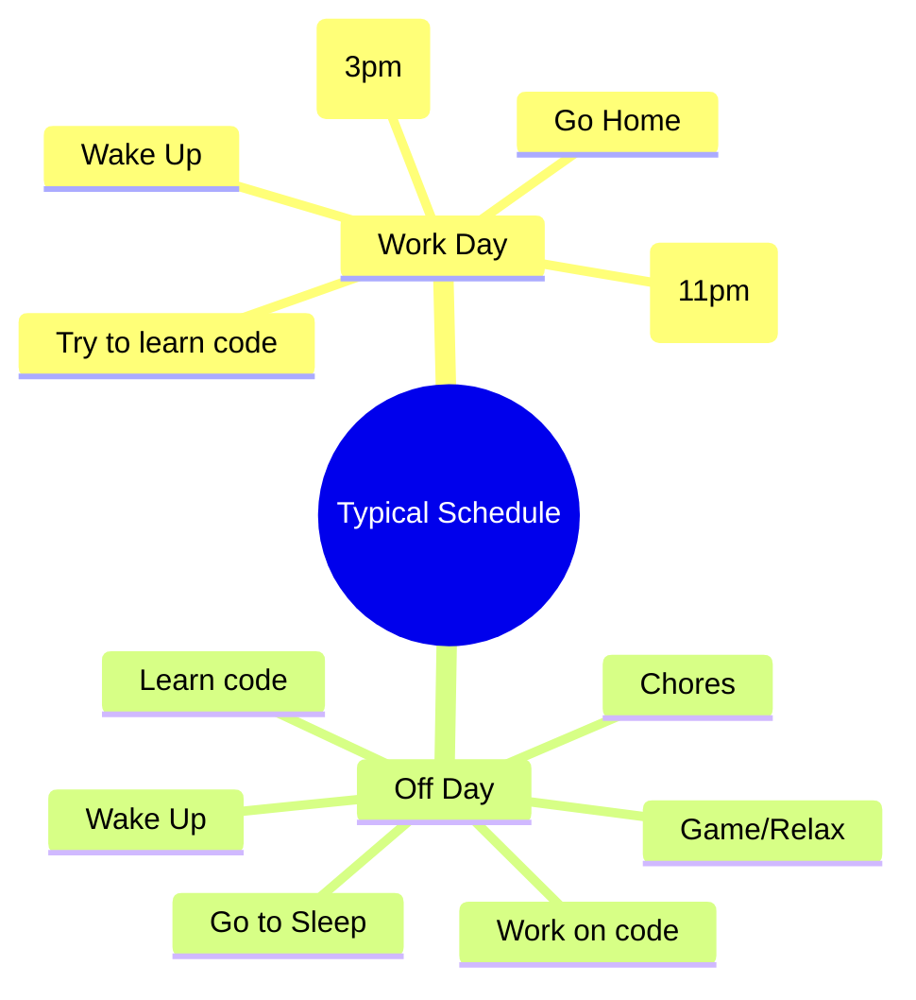

# 

  

  
  
  
  
  

---

## Ghostridr's GitHub Profile

Welcome to my GitHub profile!

- [👤 About Me](#about-me)
- [🌟 Quick Facts](#quick-facts)
- [🚀 My Projects](#my-projects)
  - [Ghost Hackers](#ghost-hackers)
  - [Personal Repo Profile](#personal-repo-profile)
  - [Ghost Hackers Archive](#ghost-hackers-archive)
- [🏅 Skill Badges](#skill-badges)
- [📊 GitHub Metrics](#github-metrics)
- [🗓️ Mindmap](#️mindmap)

---

## About Me

Hey, I'm **Ghostridr**!  
Founder & Owner of [Ghost Hackers](https://github.com/Ghost-Hackers)

I'm a passionate self-taught developer, tech enthusiast, and founder of the [Ghost Hackers](https://github.com/Ghost-Hackers) organization. My journey began with burning curiosity and a drive to automate, optimize, and create. I thrive on learning new technologies, building useful tools, and collaborating with like-minded people. I believe in the power of open source, community, and continuous learning. My mission is to build innovative solutions, automate the boring stuff, and help others grow through what I've learned and can share.

With a growing background in both creative and technical fields, I enjoy bridging the gap between design and development. Whether it's scripting automation, building bots, or architecting web solutions, I approach every project with a focus on quality, security, and user experience straight out of the gate. Today's developers need to be versatile, and I strive to embody that by constantly expanding my skill set and adapting to new challenges.

One thing I've noticed in conversations with developers from all over is a common mindset: "Just ship something that works now, and fix crashes or quality issues later." While I understand the value of iteration and rapid prototyping, I believe in planning ahead and building with reliability in mind from the start. For me, anticipating challenges and designing for stability isn't just about avoiding problems—it's about respecting users and taking pride in my craft. No one wants to use a tool that breaks or behaves unpredictably as this will only drive them away in a hurry. I want to create experiences that people can trust and enjoy and I believe that starts with a solid foundation and a commitment to quality.

- 🏆 **Achievements:**
  - Founded and lead the Ghost Hackers organization, fostering a collaborative and inclusive environment for developers and tech enthusiasts, both learning and experienced.

- 💡 **Philosophy:**
  - "Code should empower, not complicate."
  - I believe in sharing knowledge, learning from failure, and celebrating progress—no matter how small.

- 🌐 **Mission Statement:**
  - My mission is to keep growing as a developer, always learning new ways to code, build, and solve problems. I strive to anticipate the needs of others—sometimes before they even realize those needs exist—and to create solutions that empower, support, and inspire. Whether it's through automation, collaboration, or sharing knowledge, I want my work to make a fun, positive impact and help others achieve more with technology.

### Quick Facts

  | **Languages I've used:** | **Other Tech/Frameworks:** | **Tools I enjoy:** |
  |:------------------------|:--------------------------|:------------------|
  |        |    |      |

  | **Current Focus:** | **Currently Learning:** | **Open to:** | **Interests:** |
  |:-------------------|:------------------------|:-------------|:---------------|
  | Building automation bots and enhancing my JavaScript skills | Deepening my expertise in advanced JavaScript, PHP frameworks, and building automation bots | Collaborating on innovative projects, receiving mentoring, and exploring new ideas | Coding, automation, open source, and the latest in gaming innovations |

---

## My Projects

I love working on projects that challenge me and help others along the way. Here are some of my current and past projects:

###  Ghost Hackers

  | **Active** | **Inactive** | **Deprecated** | **On Hold** | **Archiving** |
  |:---|:---|:---|:---|:---|
  |   |    |  |  |  |

###  Ghost Hackers Archive

  | **Archived** |
  |:---|
  |  |

### Personal Repo Profile

  | **Active** | **Inactive** | **Deprecated** | **On Hold** | **Archiving** |
  |:---|:---|:---|:---|:---|
  |  |  |  |  |  |

---

## Skill Badges

       

---

  
  &nbsp;
  

  

  

---

## Mindmap

---

> If we pull together and commit ourselves, then we can push through anything.

— Unknown

<!---
Ghostridr/Ghostridr is a ✨ special ✨ repository because its `README.md` (this file) appears on your GitHub profile.
You can click the Preview link to take a look at your changes.
-->
